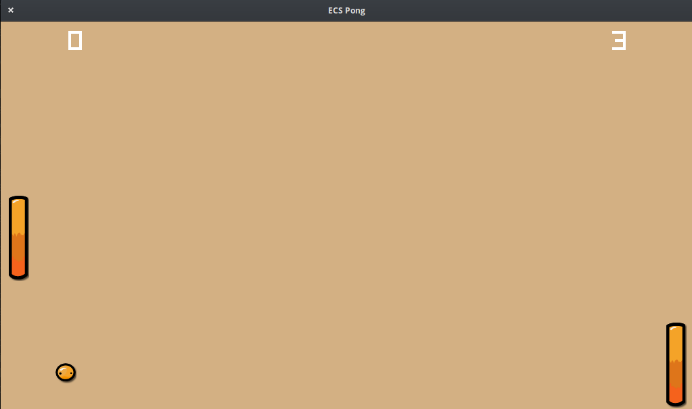

# ECS Pong

A basic demonstration of using an Entity Component System for Game Development.

**Table of Contents**

- [Goals](README.md#goals)
- [Installation](README.md#installation)
- [Usage](README.md#usage)

## Goals

## Installation

**From Source**

    git clone github.com/andygeiss/ecs-pong.git
    cd ecs-pong
    go install

## Usage

**Controls**

| Key | Description                 |
|-----|-----------------------------|
| W   | Move player paddle UP       |
| S   | Move player paddle DOWN     |

**Binary**

    ecs-pong
